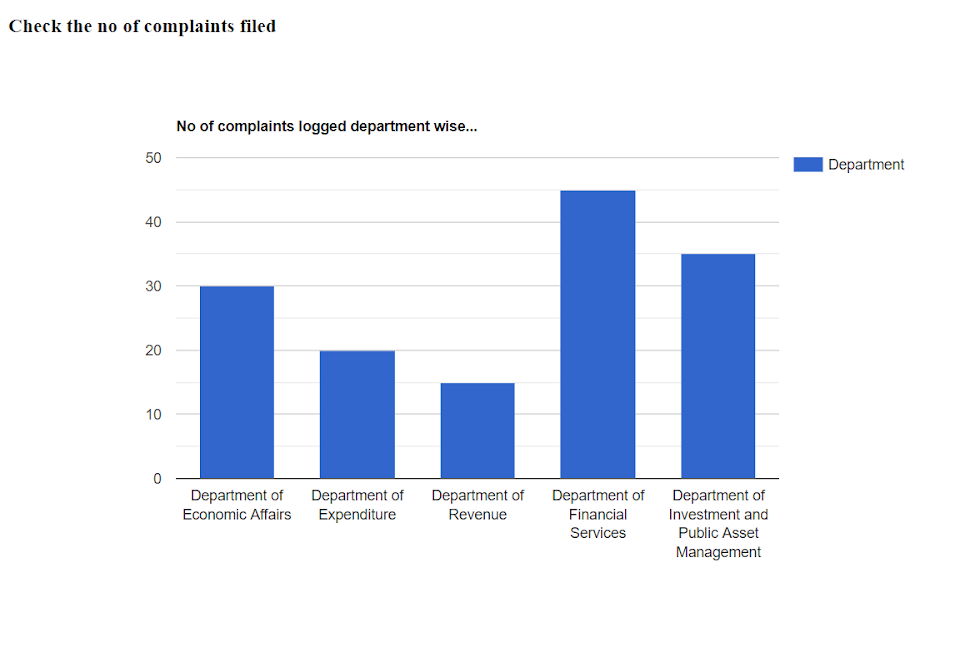
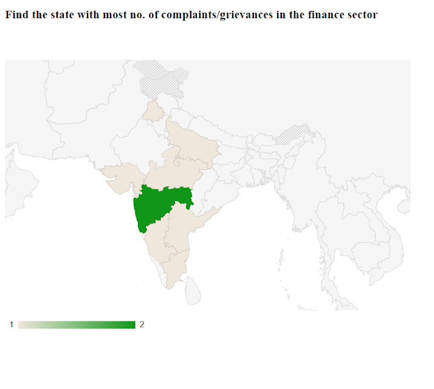
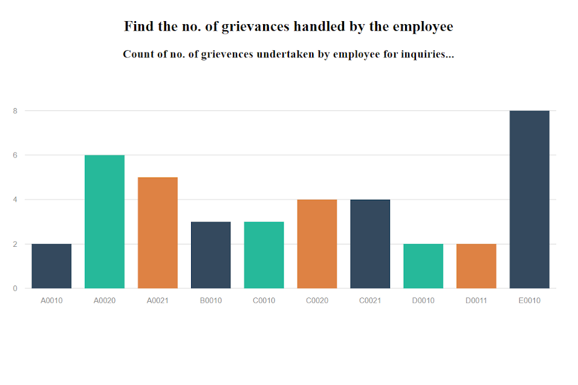

# Grievance Redressal Application
This is a web application for an organizations, which aids it’s users to post their grievances to the concerned body within the organization, and get their complaints
addressed in the best possible manner from the concerned authorities in minimal time. 
This application was designed for 5 departments under the Finance Sector for the Government of India and is scalable to any sector with any number of departments.

# Framework-used
NodeJS, React, HTML, CSS, MySQL and PHP.

[Demo Video](https://drive.google.com/file/d/1vwvqrwDyEbgOz40yG9VG7YL26pIJLE2q/view?usp=sharing)

The application has sperate views for admin, employee and user:

# Admin
### Admin Dashboard - 

### Admin can manage the emloyees and user info in the system.

# Employee
### Employee Dashboard -

### Employee can change the status of the grievance when its addressed.

# User
### User Dashboard -

### User can view detailed information of the grievances submitted by them.

# Reports Generated
The application allows the organization's employees and admins to see statistics and identify weaker points of the organization.
Some sample reports generated:

